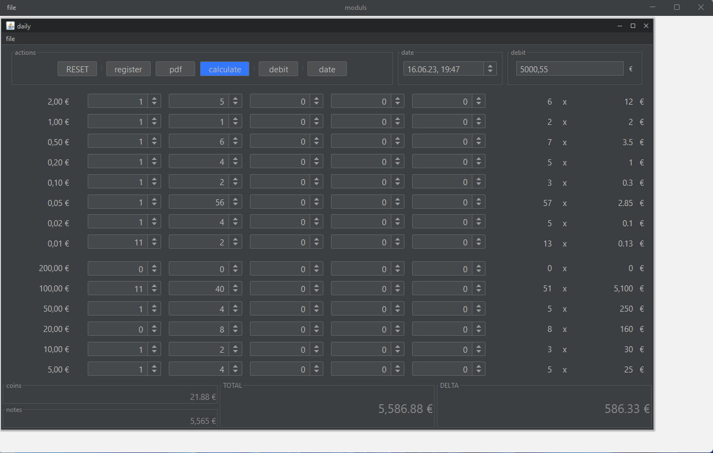
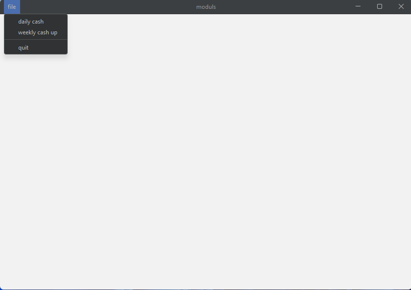
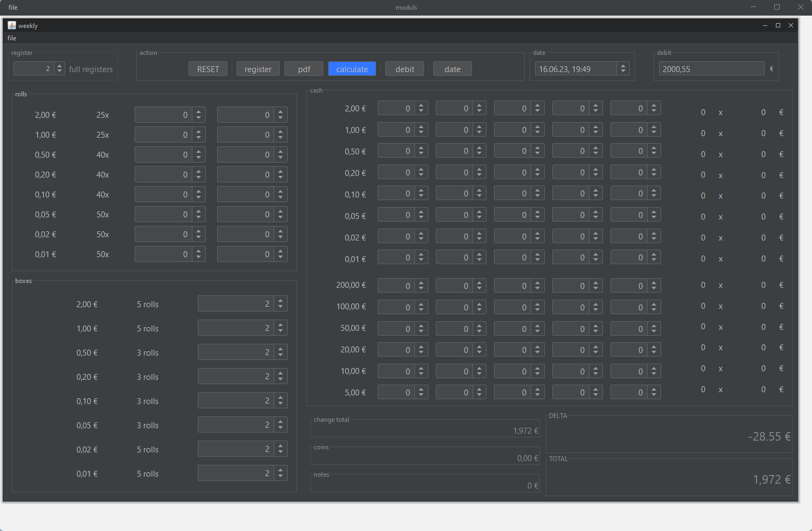

# Cashup

Cashup is a Java Swing-based application for managing daily and weekly cash counts in your cash register. It facilitates
the process of calculating the cash difference at the end of each day or week, logging this information into a cash
book, and storing it as a PDF.



## Features

- **Cash Counting**: Count your cash quickly and accurately.
- **Cash Difference Calculation**: Calculates the difference between the actual and expected cash.
- **Automatic Cash Book Logging**: Possibility to activate Python scripts that automatically log cash differences into
  your cash book.*
- **PDF Generation**: Generates a PDF document for each cash count.
- **Daily and Weekly Cash Counts**: Perform cash counts at the end of each day or week.

*) This feature is not included. You will have to write your own Python scripts to automate the logging process. You can
use [PyAutoGUI](https://pyautogui.readthedocs.io/en/latest/index.html) to interact with the user interface of your own
program.

## Technical Details

Cashup is built on Java 17 and uses Maven for project management. It uses Java Swing to create its user interface. For
automation tasks, you can set up your own Python scripts which might interact with your other user interfaces for example
using the PyAutoGUI library. These scripts might extract the expected cash value or save the difference between
expected and actual cash amount.

## Dependencies

The project has several dependencies which are handled by Maven:

- `miglayout-swing` for layout management in the UI.
- `flatlaf` for the look and feel of the UI.
- `pdfbox` to generate PDF documents.
- `slf4j-api` and `logback-classic` for logging purposes.

Check the `pom.xml` file for more details on versions and scopes.

## Running Cashup

To run the application, use the Exec Maven Plugin, which is configured in the `pom.xml` to run the main class:

```bash
./mvnw clean install
```

```bash
./mvnw exec:java
```

## License

The project is licensed under the [MIT License](https://choosealicense.com/licenses/mit/).



